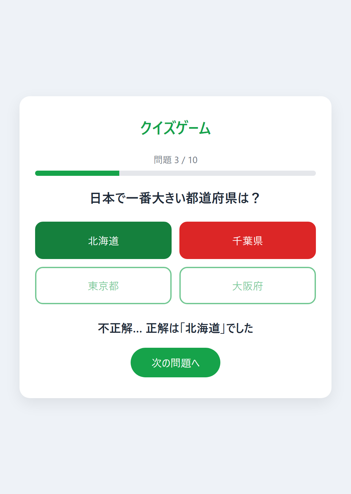

# 日本の地理クイズ

HTML・CSS・JavaScript だけで作った、ブラウザで遊べる4択クイズゲームです。
インストール不要で、PC でもスマホでもすぐに遊べます。

### ▶ [ゲームを遊ぶ](https://kakapo-studio.github.io/quiz-game/)

| タイトル | プレイ中 | 結果 |
|:---:|:---:|:---:|
|  |  |  |

## 遊び方

1. 「スタート」を押す
2. 4つの選択肢から答えを選ぶ
3. 全10問に答えると、点数・正答率・コメントが表示されます

## 特徴・工夫した点

- **問題データとプログラムを分離**
  問題は `questions.js` にまとめてあり、このファイルを差し替えるだけで別テーマのクイズになります。
- **毎回ちがう出題**
  問題の順番と選択肢の並びを、偏りのないシャッフル（Fisher–Yates）で毎回入れ替えています。
- **わかりやすい答え合わせ**
  選んだ答えが不正解なら赤、正解の選択肢を緑で表示し、正解がひと目でわかるようにしています。
- **進み具合と結果の表示**
  「問題 3 / 10」の表示と進行バー、結果画面では正答率に応じたコメントを表示します。
- **スマホ対応**
  画面幅に合わせたレイアウトにし、回答時に画面がずれない（レイアウトシフトしない）ようにしています。

## 使用技術

- HTML / CSS / JavaScript（ライブラリ・フレームワーク不使用）
- GitHub Pages（公開）

## ファイル構成

```
quiz-game/
├── index.html    画面の構造
├── style.css     見た目
├── script.js     ゲームの動き
├── questions.js  問題データ
└── images/       README 用のスクリーンショット
```

## 問題の追加・変更方法

`questions.js` の配列に、次の形のデータを追加します。
問題数はタイトル画面・結果画面に自動で反映されます。

```js
{
  text: "問題文",
  choices: ["選択肢1", "選択肢2", "選択肢3", "選択肢4"],
  answer: "正解の選択肢（choices のどれかと同じ文字）",
},
```

## 作者

kakapo（[kakapo-studio](https://github.com/kakapo-studio)）
